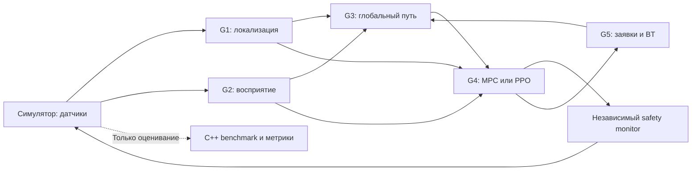

# Автономный складской робот: магистерский командный проект на C++

Сокращения раскрыты при первом употреблении; [полный словарь терминов](docs/GLOSSARY.md).

**12 студентов · 5 подгрупп · 2 метода в каждой подгруппе · 25 + 15 = 40 баллов на студента.**

Проект продолжает курс [«Продвинутые автономные мобильные роботы — C++»](https://github.com/Yazan-pyth/advanced_autonomous_mobile_robots_cpp_ru). Это отдельное задание **для магистрантов**, рассчитанное на 14 учебных недель. Его шкала 40 баллов самостоятельная: она не изменяет автоматически процентную шкалу исходного курса.

## Общая задача

Создать автономного дифференциального робота, который выполняет заявки на доставку между станциями небольшого склада: локализуется, обнаруживает препятствия, выбирает маршрут, управляет движением и меняет порядок заявок при задержках. Проверить, когда обучаемые методы полезнее классических, а когда уступают им по надёжности, качеству или вычислительной стоимости.

Общий результат — **один интегрированный робот**, пять сравнительных исследований и воспроизводимый эксперимент. Загрузка и разгрузка моделируются остановкой на станции; манипулятор, реальное оборудование и несколько роботов не обязательны.

## Пять подгрупп

| Группа | Студентов | Ответственность | Классический метод | DL (Deep Learning — глубокое обучение)/RL (Reinforcement Learning — обучение с подкреплением)-метод |
|---|---:|---|---|---|
| [G1](projects/01_localization.md) | 3 | Локализация и геометрическая карта | EKF (Extended Kalman Filter — расширенный фильтр Калмана) + scan-to-map ICP (Iterative Closest Point — итеративный алгоритм ближайших точек для совмещения облаков точек), фиксированная модель шума | Та же схема с MLP (Multilayer Perceptron — многослойный перцептрон) для адаптивной ковариации измерений |
| [G2](projects/02_perception.md) | 2 | Восприятие и локальная карта препятствий | Геометрическая обработка RGB-D (Red, Green, Blue and Depth — цветное изображение и карта глубины): плоскость пола, кластеры | Небольшая CNN (Convolutional Neural Network — свёрточная нейронная сеть) сегментации проходимой области |
| [G3](projects/03_planning.md) | 2 | Глобальное планирование | A* (A-star — алгоритм поиска пути с оценкой уже пройденной стоимости и эвристикой оставшегося пути) с фиксированной стоимостью проходимости | A* с обученной CNN-картой стоимости |
| [G4](projects/04_control.md) | 3 | Локальное управление и независимый safety monitor | Ограниченный MPC (Model Predictive Control — управление с прогнозирующей моделью) | PPO (Proximal Policy Optimization — алгоритм оптимизации политики с ограничением величины её обновления)-политика локального управления |
| [G5](projects/05_mission.md) | 2 | Диспетчеризация заявок и общая сборка | Behavior Tree + фиксированное правило выбора заявки | DQN (Deep Q-Network — глубокая нейронная сеть для оценки ценности действий) для выбора следующей заявки внутри того же BT (Behavior Tree — дерево поведения) |
| **Всего** | **12** | | | |

MLP и CNN должны реально обучаться или дообучаться, а не служить переименованной эвристикой. Использование одинакового EKF/A*/BT вокруг модели разрешено: предмет исследования — заменяемая обучаемая часть. G4 изучает RL на уровне движения, G5 — на уровне миссии.



## Обязательные результаты

1. Исходники C++17, CMake/ament, ROS 2 (Robot Operating System 2 — вторая версия программной платформы для робототехники) `rclcpp`, тесты и Git-история с review.
2. Рабочие классический и DL/RL-варианты **каждой** подгруппы с единым интерфейсом и выбором через конфигурацию.
3. Один Docker-контейнер или два: симулятор и автономная система. В этом шаблоне предусмотрены два.
4. Зафиксированные train/validation/test-сценарии, обученные модели с hash и инструкции воспроизведения.
5. Метрики, доверительные интервалы, анализ ошибок и отрицательных результатов, а не только видео или reward.
6. Пять отчётов по 8–12 страниц и один интеграционный отчёт 10–15 страниц, не считая приложений.
7. Общая демонстрация всех пяти компонентов, сравнение систем и проверка отказов.

## Как работать с заданием

- [Постановка, ограничения и связь с курсом](docs/PROJECT.md)
- [ROS 2 интерфейсы, временные бюджеты и безопасность](docs/INTERFACES.md)
- [Эксперименты, метрики и статистика](docs/EXPERIMENTS.md)
- [Критерии оценивания: 25 + 15](docs/GRADING.md)
- [Команда, Git, план на 14 недель](docs/WORKFLOW.md)
- [Docker и границы стартового кода](docs/DEVELOPMENT.md)
- [Шаблон отчёта](templates/REPORT.md), [модель](templates/MODEL_CARD.md), [вклад студента](templates/CONTRIBUTION.md)
- [Технические первоисточники](docs/REFERENCES.md)

## Статус репозитория

Это **задание и стартовая инфраструктура**, а не готовое решение студентов. В комплект входят описания пяти проектов, контракты ROS 2, экспериментальный план, рубрика, C++-проверка `/clock`, минимальный пустой мир Gazebo и CI (Continuous Integration — непрерывная интеграция; автоматическая сборка и проверки) для двух контейнеров. Алгоритмы, модель робота, датчики, складские сценарии, benchmark и обученные модели должны быть разработаны студентами. Успешная проверка `/clock` не означает готовность автономной навигации.

Базовый стек: Ubuntu 24.04, ROS 2 Jazzy, Gazebo Harmonic, C++17, Eigen/OpenCV (Open Source Computer Vision Library — открытая библиотека компьютерного зрения), ONNX (Open Neural Network Exchange — открытый формат обмена моделями нейронных сетей) Runtime или LibTorch. Допускается другой симулятор при сохранении общих интерфейсов и benchmark. Вся группа использует один выбранный симулятор. Python допускается **только offline** для подготовки данных и обучения, как в исходном курсе; исполнение робота, inference, runner и расчёт метрик — C++.

## Стартовая проверка инфраструктуры

На Linux либо Windows с Docker Desktop в режиме Linux containers:

```bash
git clone https://github.com/Yazan-pyth/autonomous-robotics-masters-capstone-cpp-ru.git
cd autonomous-robotics-masters-capstone-cpp-ru
docker compose build
docker compose up --abort-on-container-exit --exit-code-from autonomy
docker compose down
```

Ожидается `PASS: simulation clock advanced`, завершение `autonomy` с кодом 0 и остановка симулятора. Если `/clock` не продвигается, проверка завершается ошибкой по wall-clock timeout. Подробнее — [DEVELOPMENT.md](docs/DEVELOPMENT.md).
